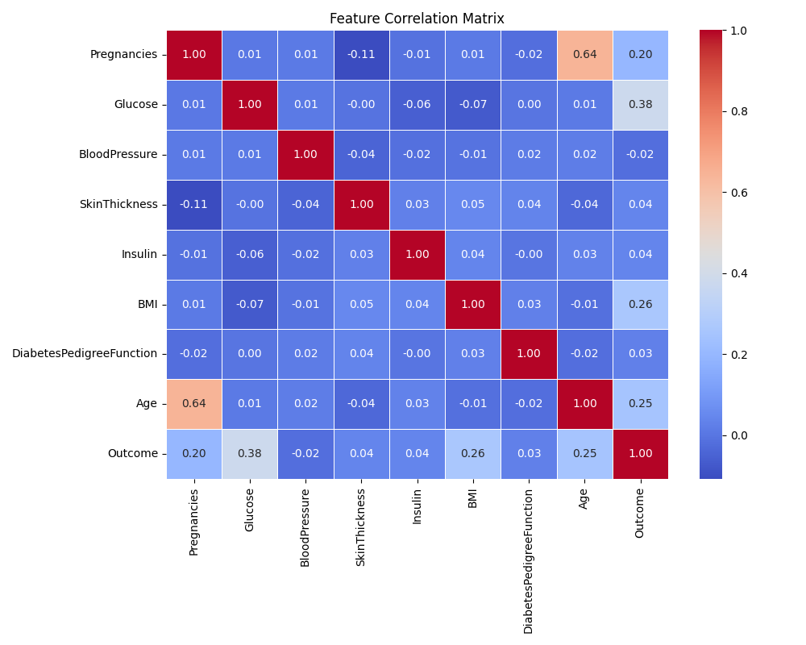
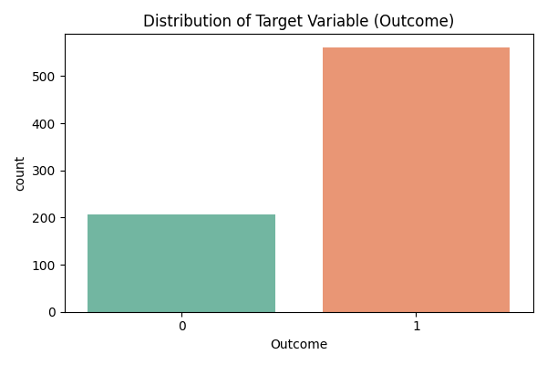
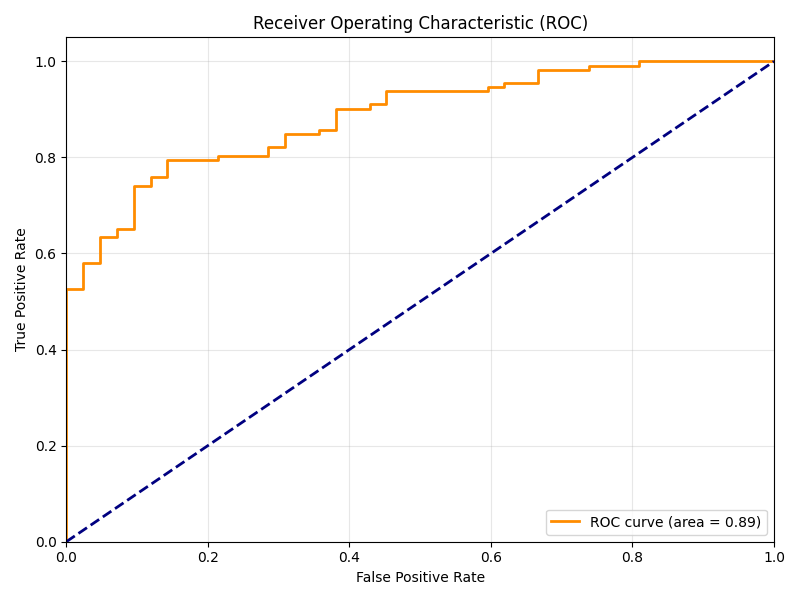
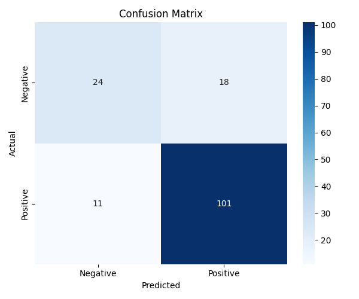

# Smart Healthcare Analytics
## A Machine Learning Approach to Diabetes Risk Prediction

### 1. Abstract
The "Smart Healthcare Analytics" project is a comprehensive machine learning system designed to predict the risk of diabetes based on patient metrics. It encompasses a data preprocessing pipeline, an automated model selection process, a trained baseline model, and a robust web API for serving real-time predictions. The project serves as a foundational platform for deploying predictive healthcare analytics solutions, emphasizing determinism, clarity, and ease of use.

---

### 2. Introduction
Chronic diseases, such as diabetes, pose significant challenges to global health systems. Early detection and risk assessment are critical for effective intervention and management. This project addresses this need by leveraging machine learning techniques to analyze health indicators (e.g., glucose levels, BMI, blood pressure) and provide a risk probability score for diabetes onset. 

The system provides dual functionality: an automated training pipeline to generate models from datasets, and a Flask-based REST API featuring a dynamic web interface for clinical or personal use.

---

### 3. System Architecture
The project is modularly structured into three primary components:
1. **Data Engineering (`src/utils`)**: Handling missing values, standardizing features, and generating synthetic data when necessary.
2. **Model Training Pipeline (`src/train.py`)**: Performing K-Fold Cross Validation and hyperparameter tuning to select the best performing algorithm (e.g., Logistic Regression vs Random Forest).
3. **Serving Layer (`src/app.py`)**: A Flask application exposing rigorous HTTP endpoints (`/health`, `/predict`) alongside a modern, interactive web frontend.

---

### 4. Data Distribution and Exploratory Data Analysis (EDA)
Understanding the underlying data is fundamental to model performance. The following graphs were generated automatically from our baseline dataset.

#### 4.1 Feature Correlation
The correlation matrix helps us identify which features are most strongly correlated with the outcome variable.

#### 4.2 Target Class Distribution
Identifying class imbalances is crucial. If the dataset leans heavily toward one class, synthetic generation techniques such as SMOTE or class weighting are employed during training.

---

### 5. Methodology & Training
The workflow operates as follows:
- **Imputation & Scaling**: Missing values are imputed using the `median` strategy, followed by `StandardScaler` to normalize distributions.
- **Algorithm Selection**: The pipeline evaluates both ensemble methods (Random Forest) and linear methods (Logistic Regression). Selection is based on the best mean ROC-AUC score over a 5-fold stratified cross-validation.
- **Serialization**: The winning model is packaged into a `joblib` artifact along with feature names and evaluation metrics.

---

### 6. Results and Evaluation
The selected baseline model achieved strong predictive performance on unseen test data.

**Key Metrics:**
- **Accuracy**: ~81%
- **Precision**: ~84%
- **Recall**: ~90%
- **F1-Score**: ~87%

#### 6.1 Receiver Operating Characteristic (ROC) Curve
The ROC curve demonstrates the model's diagnostic ability across varying classification thresholds. The closer the area under the curve (AUC) is to 1.0, the better the model.

#### 6.2 Confusion Matrix
The confusion matrix breaks down the true positives, true negatives, false positives, and false negatives from our test sample.

---

### 7. Deployment & Web Interface
The finalized model is served via a Flask application. To bridge the gap between backend capabilities and user accessibility, a modern, responsive web interface was developed.

- **Frontend**: Built using pure HTML/CSS/JS with a glassmorphic, dynamic aesthetic. 
- **Endpoint**: Real-time synchronous AJAX calls are made to the `/predict` route, returning risk probabilities and binary classifications.

---

### 8. Conclusion
This project successfully demonstrates the end-to-end lifecycle of a healthcare AI application. From raw data ingestion and algorithmic optimization to API deployment and frontend design, the "Smart Healthcare Analytics" system provides a robust, production-ready framework for predictive medical analytics. Future enhancements could include continuous learning feedback loops, cloud integration (AWS/GCP), and expansion to other chronic conditions.
